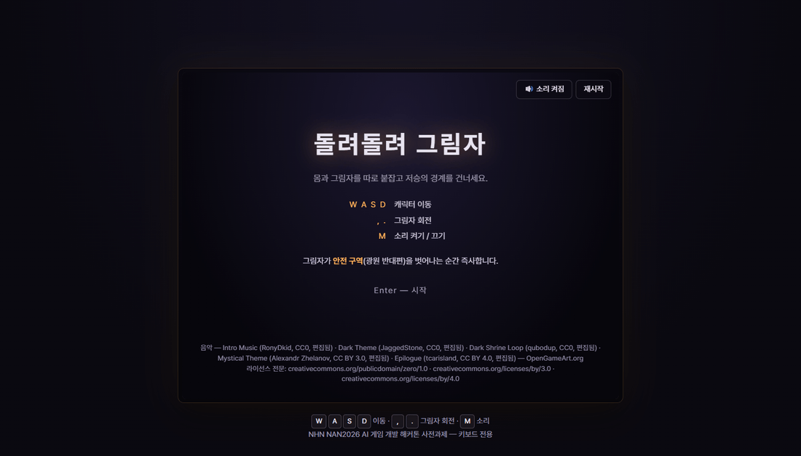
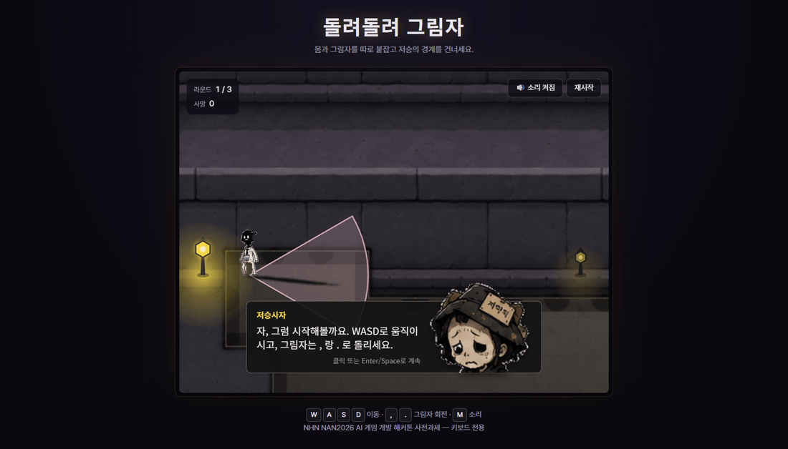
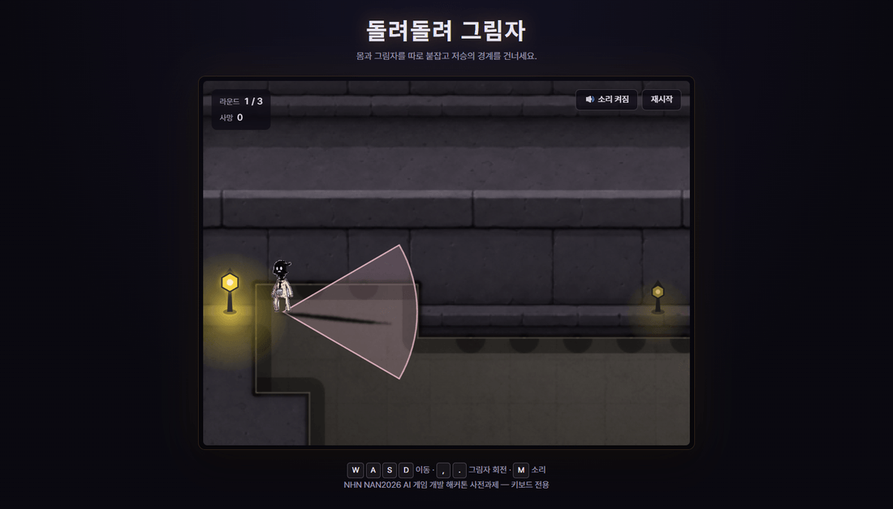
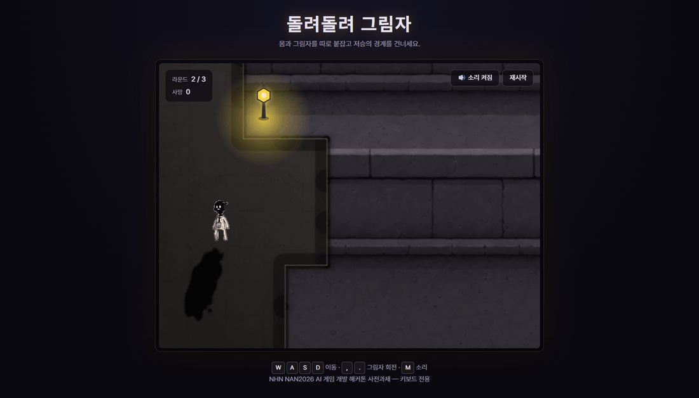
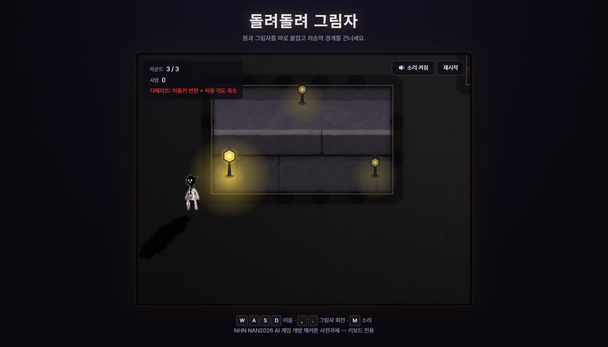

# 게임 소개 및 설명 문서

> NAN2026 사전과제 제출용 5종 중 하나 — 제출 마감 2026-08-10
> 작성: 배영환 · 최종 갱신: 2026-08-07

---

## 1. 게임 개요

| 항목 | 내용 |
|---|---|
| 제목 | **돌려돌려 그림자** |
| 장르 | 키보드 전용 이중 조작 액션 퍼즐 (싱글 플레이) |
| 플랫폼 | 웹 브라우저 — 설치 불필요 |
| 한 줄 소개 | 캐릭터와 그림자를 동시에 조종해, 광원 반대편 안전 구역을 놓치지 않고 이승과 저승의 경계를 넘는다 |

**배경** — 저승사자가 동명이인 착오로 주인공을 저승에 데려온다. 아직 죽을 때가 아닌 주인공은 경계를 다시 넘어야 하는데, 그동안 그림자가 불안정해져 몸과 그림자를 따로 붙잡고 있어야 한다.

---

## 2. 핵심 규칙

- **안전 구역**: 광원 반대편, 곧 "캐릭터 뒤 ± 허용 각도" 범위. 캐릭터가 움직이는 동안 매 프레임 다시 계산된다.
- **그림자는 따라오지 않는다**: 안전 구역과 무관하게 플레이어가 직접 돌린 각도를 그대로 유지한다.
- **그래서 동시 조작이 된다**: 캐릭터가 움직이면 안전 구역도 함께 움직이므로, 이동하면서 그림자를 계속 맞춰 돌려야 한다.
- **벗어나면 즉사**: 그림자 각도가 안전 구역 밖으로 나가는 순간 사망 처리된다.

---

## 3. 조작

| 키 | 동작 |
|---|---|
| `W` `A` `S` `D` 또는 방향키 | 캐릭터 이동 |
| `,` | 그림자 시계방향 회전 |
| `.` | 그림자 반시계방향 회전 |
| `M` | 음소거 토글 |
| `Enter` / `Space` | 대사·컷신 진행, 타이틀에서 시작 |

게임플레이는 **키보드만으로 완결**된다. 화면의 재시작·음소거 버튼은 마우스로도 누를 수 있지만, 없어도 플레이에 지장이 없다.

---

## 4. 라운드 구성

| 라운드 | 변화 | 플레이어가 하게 되는 일 |
|---|---|---|
| **1R** | 안전 구역이 부채꼴 가이드라인으로 표시된다 | 규칙을 눈으로 익힌다 |
| **2R** | 가이드라인이 사라진다 | 광원 위치만 보고 안전 구역을 추측한다 |
| **3R** | 허용 각도 절반 축소 + 이동키 상하좌우 반전 (그림자 회전키는 그대로) | 좁아진 각도를 반전된 조작으로 맞춘다 |

---

## 5. 목표와 종료 조건

**목표** — 1R부터 3R까지 순서대로 통과한다. 각 라운드는 절차적으로 생성된 새 지형이며, 스폰에서 시작해 골(주황 원)에 닿으면 다음 라운드로 넘어간다. 3R의 골에 도달하면 전체 클리어다.

**세이브 포인트** — 코스 중간에 파란 원이 1개 있다. 밟고 갈지 지나칠지는 플레이어의 선택이며, 하나도 밟지 않고 클리어할 수 있다.

**클리어** — 3R의 골에 도달하면 엔딩 컷신이 재생되고, 총 사망 횟수·클리어 시간을 담은 결과 요약으로 끝난다.

**사망** — 게임 오버가 아니라 리스폰이다.

- 짧은 사망 연출 후, 그 라운드에서 **직접 밟아 활성화한** 세이브 포인트로 돌아간다 (밟은 적이 없으면 스폰).
- 라이프 제한은 없다.
- 우측 상단 "재시작"으로 언제든 1R부터 다시 시작할 수 있다.

---

## 6. 화면











---

## 7. 실행 방법

**플레이 링크** — [https://baeyounghwan.github.io/NAN2026/](https://baeyounghwan.github.io/NAN2026/)

**플레이 영상** — [https://www.youtube.com/watch?v=zsrd9mrBQdI](https://www.youtube.com/watch?v=zsrd9mrBQdI)

**권장 환경** — 최신 데스크톱 Chrome / Edge에서 동작을 확인했다. 키보드가 필요하다.

**소스에서 직접 실행**

```bash
npm install
npm run dev       # http://localhost:5173
```
